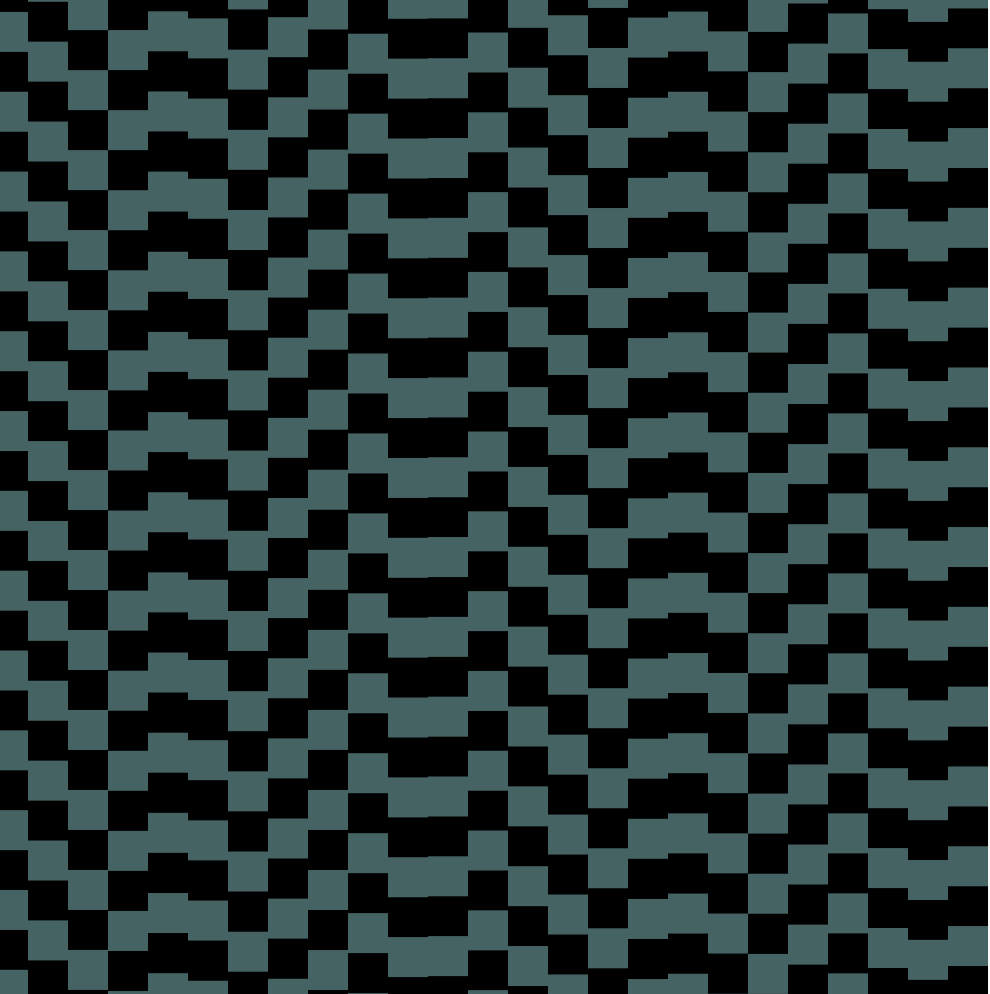
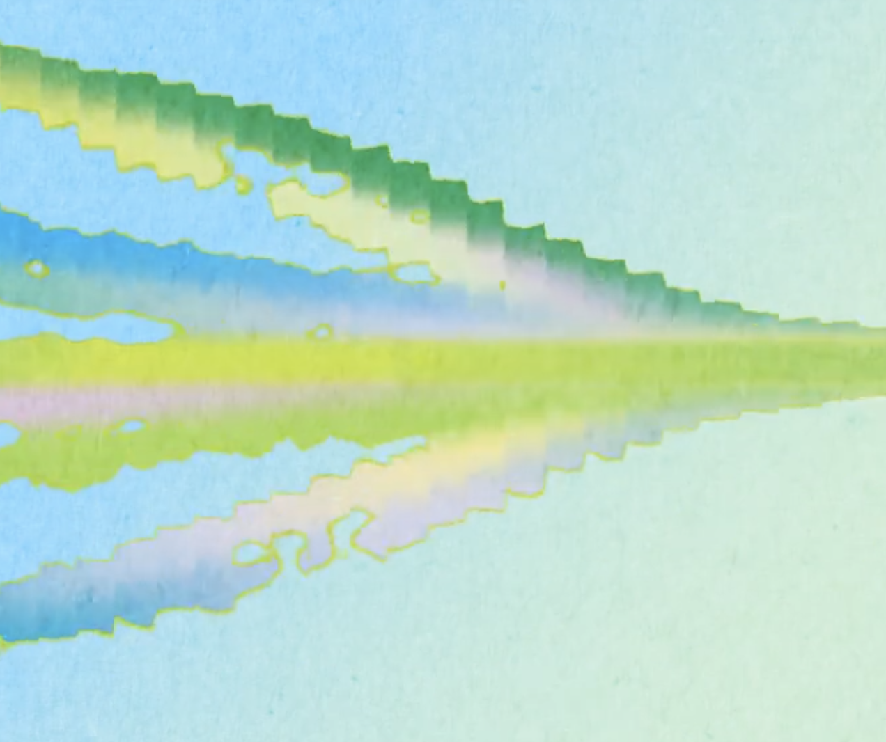

# IDEA9103 MAJOR PROJECT - INDIVIDUAL


Hi! Welcome to my individual part of the animation of our Group Work: the representation of Broadway Boogie Woogie. The following content will give you a detailed *(maybe not quite)* instruction and introduction to my work.

## Instruction

This is an audio-based animated work. The interaction is simple, just click on the button outside the canvas to shift the artwork into 'nighttime', and wait until the music starts. 

You will see deconstructed lines move according to the music spectrum in a form of waves. The shapes will cross and separate, creating a vivid scene. The bigger parts will also change sizes and colours according to the music.


## Deatils of my approach

- The type of my animation is audio-based.
- Aside from the size change of big rects (class:BigRectangles), which some of my groupmates is also doing, in my work there is a wave movement of rows and columns of rectangle lines, creating a dynamic and sensual atmosphere.


## My Inspirations:

My inspirations are:
[This rec code in the p5.js community](https://github.com/preziotte/party-mode?tab=readme-ov-file).

.

[This online artwork] https://www.xiaohongshu.com/explore/6537a63e000000001e02f2d4

.

I really like their smooth, curvy movements.

##A short technical explanation


### The lines
-I spent a lot of time trying to make the original rows and columns to move wave-like and at the same time maintaining their colour patterns. But as we eventually constrcuted it by constantly drawing, and that the color array is too huge, I was unable to achieve my wanted effects with the group code merely. So I applied an alternative way. 

-drawWithAudioEffects(): I create new rectangles that changes their position based on frequency data, which is mapped to amplitude array. This part is mostly inspired and adopted from [this code in the p5.js community](https://github.com/preziotte/party-mode?tab=readme-ov-file). This code has provided me with lots of useful insights about mapping arrays to create synchronisation.

For example:
```javascript
 for (let i = 0; i < numBars; i++) {
     // Map the frequency value to an index for the colors array
    let colorIndex = mapColorIndex
  (spectrum[i]) % colors.length;
    let color = colors[colorIndex];
 }
```

### The Big rectangles

-I intended to do a lerpColor change along with the size change of big rectangles but struggled about how to build the section. And I was mesed up with too many variables and steps. ChatGPT helped me on this. 

```javascript
let colorIndex = index % colors.length;
        let dynamicColor = color(colors[colorIndex]); // Convert the color code to a p5.js color object
  
        // Ensure rectangle.color is a p5.js color object
        if (typeof rectangle.color === 'string') {
          rectangle.color = color(rectangle.color); // Convert existing color code to a p5.js color object
        }
```
This code uses the index colorIndex from the colors array to select a colour value, which is then converted to a p5.js colour object. Then it checks if the colour property is a string. If it is, the color() function is used to convert the string to a colour object for drawing.

- I also learned to use forEach to accepts a callback function as an argument and executes it for each element in the array.


### Something Else
- -I use the togglePlaying() p5.js function to handle multiple events, separating the the original condition and the animated condition. 

```javascript
function togglePlaying() {
    if (song.isPlaying()) {
      song.pause(); // Pause the music
      isButtonPressed = false;
      button.html("Night");
      resetBigRectangles(); // Reset the state of bigRectangles
    } else {
      song.loop(); // Play the music
      isButtonPressed = true;
      button.html("Day");
    }
  }
  ```


## Thank you for reading!